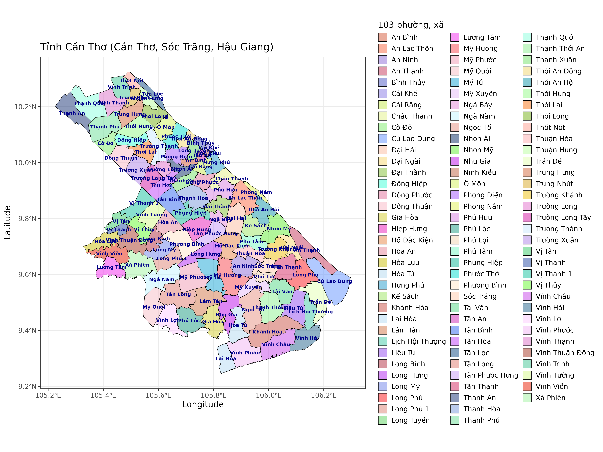

```{r, echo=FALSE, results='hide'}
knitr::opts_chunk$set(message = FALSE,  
                      warning = FALSE,
                      echo = FALSE)   
```


<!-- # TRA CỨU TÊN XÃ MỚI -->

Nguồn: `https://gis.vn/don-vi-hanh-chinh-viet-nam`

```{r,results = "hide"}
library(dplyr)
library(sf)

# bao gom cac tinh sau sat nhap
# cantho_v1 <- st_read("Cần Thơ (phường xã)/Cần Thơ (phường xã).shp")
# 
# cantho_v1$ten_xa[cantho_v1$ten_xa == "Cờ Đỏ"] <- "Cờ Đỏ"
# 
# cantho_v1$ten_xa[cantho_v1$ten_xa == "Hỏa Lựu"] <- "Hỏa Lựu"
# 
# as.data.frame(cantho_v1) -> df

# cantho_v1 <- readRDS("F:/VAULT12/R/DRCUONG_PASTEUR/PROJECT_CHUAN_V3/cantho_SHP.rds")
cantho_v1 <- readRDS("cantho_SHP.rds")

as.data.frame(cantho_v1) -> df
```

<!-- # BẢN ĐỒ -->

```{r}
cantho_name <- st_coordinates(st_point_on_surface(cantho_v1))

cantho_v1$LONG_X <- cantho_name[ , 1]

cantho_v1$LONG_Y <- cantho_name[ , 2]
```

```{r}
library(randomcoloR)
set.seed(2)
randomColor(count = nrow(cantho_v1),
            hue = c(" ", "random", "red", "orange", "yellow",
  "green", "blue", "purple", "pink", "monochrome"), luminosity = c(" ",
  "random", "light", "bright", "dark")) -> color_fill
```


```{r, eval = T, fig.width=20, fig.height=20}
library(ggplot2)
library(ggrepel)
library(ggtext)


p_main <- ggplot() + 
  
  geom_sf(data = cantho_v1,
          mapping = aes(fill = ten_xa),
          # size = 1,
          color = "black",
          alpha = 0.5)  +
  
  xlab("Longitude") +
  
  ylab("Latitude") + 
  
   scale_fill_manual(name = "103 phường, xã",
                     values = color_fill) +
  
  labs(title = "Tỉnh Cần Thơ (Cần Thơ, Sóc Trăng, Hậu Giang)") +
  
  theme_bw(base_size = 16) +
  
  guides(fill = guide_legend(ncol = 3)) +
  
  # ggrepel::geom_text_repel(data = cantho_v1, 
  #           aes(x = LONG_X,
  #               y = LONG_Y,
  #               label = ten_xa),
  #           color = "darkblue", 
  #           fontface = "bold") +
  
  geom_text(data = cantho_v1, 
            aes(x = LONG_X,
                y = LONG_Y,
                label = ten_xa),
            color = "darkblue",
            size = 3.3,
            fontface = "bold") +
  
  theme(legend.text = element_text(size = 13),
        legend.key.spacing.y = unit(0.15, "cm"))

# p_main

ggsave(filename = "cantho_new.png",
       width = 16,
       height = 12,
       plot = p_main,
       units = "in",
       dpi = 300)
```



[**DOWNLOAD FULL-SIZE**](https://tuhocr.github.io/canthosxh/cantho_new.png)


```{r}
# https://www.r-bloggers.com/2015/11/solving-the-map-coloring-problem-in-r/
# library(devtools)
# install_github("hunzikp/MapColoring")
library(MapColoring)
library(sf)
library(sp)
library(terra)
library(cshapes)
library(rgeos)
library(sp)
library(RColorBrewer)
library(CEoptim)

# gt <- GridTopology(c(0,0), c(1,1), c(8,8))
# sg <- SpatialGrid(gt)
# board <- as(as(sg, "SpatialPixels"), "SpatialPolygons")
# Ncol <- getNColors(board)
# coloring <- getColoring(board)
# ## Get Optimal contrast colors
# cand.colors <- rainbow(20)
# opt.colors <- getOptimalContrast(x=board, col=cand.colors)
## Plot
# plot(board, col=opt.colors)
# 
# 
# world.spdf <- cshp(as.Date("2012-06-30"))
# ## Use loose definition of adjacent
# 
# adj.mat <- gIntersects(gBuffer(world.spdf, width=2, byid=TRUE), byid=TRUE)
# ## Get Optimal contrast colors
# 
# cand.colors <- brewer.pal(11, "RdGy")
# opt.colors <- getOptimalContrast(x=adj.mat, col=cand.colors)
# ## Plot
# plot(world.spdf, col=opt.colors)
```


```{r}
library(DT)
df[ , -c(1,4,6,7,11,12,13)] -> cantho_all

# names(cantho_all)

cantho_all <- cantho_all[ , c(3,1,2,4,5)]

names(cantho_all) <- c("Loại", "PXM", "Sáp nhập", "Diện tích (km2)", "Dân số")

# DT:::datatable(cantho_all)

```

```{r}
# cantho_all
```


```{r}
library(readxl)
DANH_SACH_TTYTKV <- read_excel("DANH_SACH_TTYTKV.xlsx",
                               sheet = "2026")

# unique(DANH_SACH_TTYTKV$TTYTKV)
```

```{r}

names(DANH_SACH_TTYTKV) <- c("TTYTKV", "PXM")

# setdiff(DANH_SACH_TTYTKV$PXM, cantho_all$PXM)
# 
# setdiff(cantho_all$PXM, DANH_SACH_TTYTKV$PXM)
```


```{r}
cantho_merge <- merge(x = cantho_all,
                      y = DANH_SACH_TTYTKV,
                      all.x = TRUE,
                      by = "PXM")


cantho_merge <- cantho_merge[ , c(2,1,6,3)]

names(cantho_merge)[2] <- "Phường, xã mới"

cantho_merge |> dplyr:::arrange(TTYTKV) -> cantho_merge

# names(cantho_merge)

```


```{r}
library(plotly)

# cantho_v1$ten_xa -> a
# 
# cantho_merge$`Phường, xã mới` -> b
# 
# b_sorted_1 <- b[match(a, b)]
# 
# b_sorted_2 <- b[order(match(b, a))]
# 
# identical(a, b)
# identical(a, b_sorted_1)
# identical(a, b_sorted_2)
# identical(cantho_v1$ten_xa, b_sorted_1)

cantho_v1 |> dplyr:::arrange(ten_xa) -> cantho_v1
cantho_merge |> dplyr:::arrange(`Phường, xã mới`) -> cantho_merge 

# identical(cantho_v1$ten_xa, cantho_merge$`Phường, xã mới`)

cantho_v1$TTYTKV <- cantho_merge$TTYTKV
```


```{r}
library(stringi)

# base <- data.frame(terme = c("Millésime",
#                              "boulangère",
#                              "üéâäàåçêëèïîì"))

cantho_v1$ten_xa_base = stri_trans_general(str = cantho_v1$ten_xa, id = "Latin-ASCII")


cantho_v1 |> dplyr:::arrange(ten_xa_base) -> cantho_v1

```

```{r}
cantho_v1 <- cantho_v1[ , c(5,2,15,16,17)]

# cantho_v1 |> dplyr:::arrange(ten_xa) -> cantho_v2
```

```{r}
set.seed(5)

# library(RColorBrewer)
# n <- length(unique(cantho_v1$TTYTKV))
# qual_col_pals <- brewer.pal.info
# color_ttytkv <- unlist(mapply(brewer.pal,
#                               qual_col_pals$maxcolors,
#                               rownames(qual_col_pals)))
# set.seed(6)
# sample(color_ttytkv, n) -> color_ttytkv 
# color_ttytkv <- c(
# "red", "#8DA0CB", "blue", "coral", "#B2DF8A",
# "yellow", "#B3E2CD", "green", "#377EB8", "darkgreen",
# "#E7298A", "#666666", "#6A3D9A", "#FFFF99", "cyan",
# "#1B9E77", "#E31A1C", "#B15928", "lightgreen", "#FB9A99")
# https://colorspace.r-forge.r-project.org/reference/specplot.html

# library(colorspace)
# specplot(rainbow(100),
#          rgb = TRUE)

# color_ttytkv <- rainbow(length(unique(cantho_v1$TTYTKV)))
# https://r-charts.com/colors/
# color_ttytkv <- terrain.colors(length(unique(cantho_v1$TTYTKV)))

color_ttytkv <- c("navy",
                               "lightskyblue3",
                                "aquamarine3",
                                "darkseagreen2",
                                "darkolivegreen3",
                                "#e0301e",
                                "lightsalmon",
                                "green",
                               "blue",
                               "aquamarine",
                               "brown",
                                "yellow3",
                                "pink1",
                               "yellow",
                                "thistle3",
                                "tan",
                                "#2bbed8",
                                "rosybrown3",
                                "lightcoral",
                                "#B1DE6B",
                                "khaki2",
                                "#2a623d",
                                "coral",
                                "skyblue3",
                                "#8FD3C6")

color_ttytkv <- color_ttytkv[1:length(unique(cantho_v1$TTYTKV))]
```

```{r}
c(rep("blue", 103)) -> debug_col

# cantho_v1$ten_xa <- factor(cantho_v1$ten_xa)
cantho_v1$TTYTKV <- factor(cantho_v1$TTYTKV)

color_ttytkv[factor(cantho_v1$TTYTKV)] -> thanks -> thanks_ori

names(thanks) <- paste0(cantho_v1$ten_xa, "_", cantho_v1$TTYTKV)

# thanks
# thanks_ori
# grep("TTYT KV Ô Môn",
#      fixed = T,
#      names(thanks)) -> check

# check
# thanks[check]
# thanks[check] <- "yellow"

# debug_col[check] <- thanks[check]

# debug_col[c(1:5)] <- c("green",
#                        "red", 
#                        "cyan", 
#                        "yellow", 
#                        "green")

# grep("TTYT KV Bình Thủy",
#      fixed = T,
#      cantho_v1$TTYTKV) -> check
# 
# cantho_v1[check, ]
# 
# debug_col[check] <- "green"

# debug_col[1] <- "yellow"
# cantho_v1$ten_xa[1]
# 
# debug_col[2] <- "yellow"
# cantho_v1$ten_xa[2]
# 
# debug_col[3] <- "yellow"
# cantho_v1$ten_xa[3]
# 
# debug_col[4] <- "yellow"
# cantho_v1$ten_xa[4]
# 
# debug_col[5] <- "yellow"
# cantho_v1$ten_xa[5]
# 
# debug_col[6] <- "yellow"
# cantho_v1$ten_xa[6]
```


```{r}
library(plotly)

plotly_map <-   plot_ly(cantho_v1,
          split = ~ten_xa,
          color = ~ten_xa_base, # PLOTLY TÔ MÀU THEO ALPHABET TRIỆT ĐỂ
          colors = thanks_ori,
          text = ~paste0(loai, " ", ten_xa, "\n", TTYTKV),
          # text = ~ten_xa,
          hoveron = "fills",
          hoverinfo = "text",
          hoverlabel = list(bgcolor = "white"),
          stroke = I("black"),
          span = I(0.5),
          width = 600,
          height = 600) %>% 
    
    layout(showlegend = F,
           title = "\nTỉnh Cần Thơ (Cần Thơ, Sóc Trăng, Hậu Giang)") 

 plotly_map
```


```{r}
cantho_merge |> dplyr:::arrange(TTYTKV) -> cantho_merge

datatable(
  cantho_merge, 
  extensions = 'Buttons', 
  options = list(
    dom = 'Blfrtip',
    buttons = c('copy', 'excel', 'pdf'),
    lengthMenu = list(c(-1, 10, 30), 
                      c('All', '10', '30')),
    paging = T)
)
```


<!-- `https://rstudio.github.io/DT/` -->